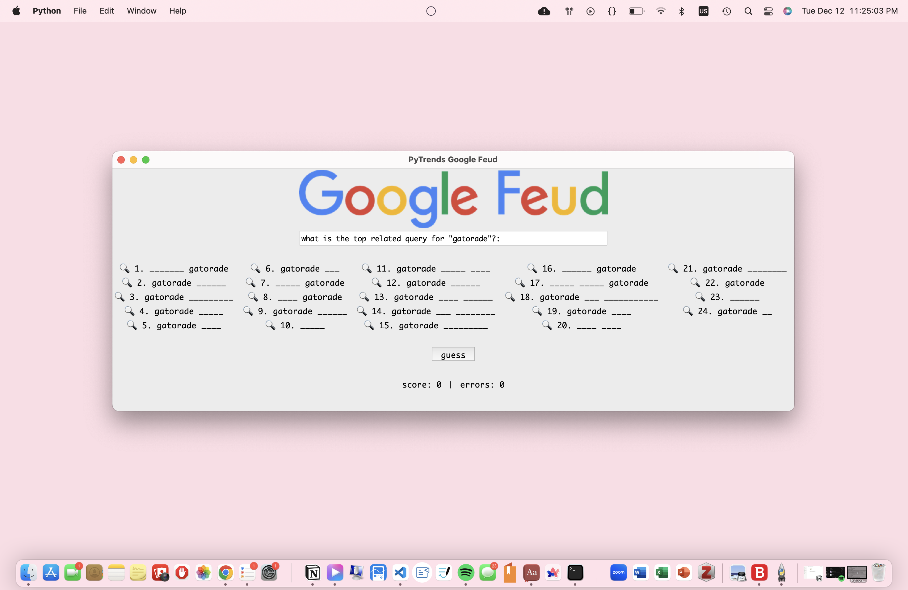
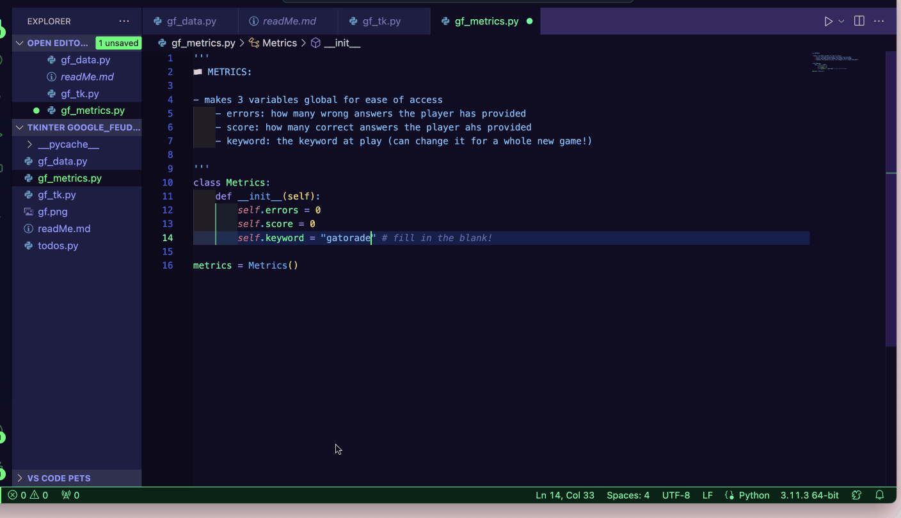

## 👩🏻‍💻 DESCRIPTION
> welcome to `google feud 🔍`, a game that asks you to embody your inner google autocomplete and fill in the blanks for the most common autocomplete suggestions of a certain prompt! this project was heavily inspired by the popular online game, [**google feud**](https://googlefeud.com/).


⬆️ opening still of `google feud`
<br>
> i recreated the game with the [**pytrends API**](https://pypi.org/project/pytrends/), an API that connects to google trends for stats on top queries, related queries, etc. with the data from this API, this game was born. and to beautify the project, i used [**tkinter**](https://docs.python.org/3/library/tkinter.html), a python GUI.

> this project was a result of a penchant to learn about what makes software _software_ in this day and age. my uni's curriculum is heavily concepts-based, which is definitely necessary and important information, but i was curious about how to translate that theoretical knowledge into practice. enjoy my little experiment!

## 💡 INSTRUCTIONS 
* delete the prompt in the query box
* using the length of the blanked-out top queries, type in your guess for the top-most related query for _x_ prompt
* press the "guess" button
* if you are wrong, your "errors" count will go up by one. if you are right, your "score" will go up by one and you'll see that prompt filled in on your screen. 
* continue guessing! too many errors and your game will end; if you fill in every blanked-out query, you win!

### other details 🌟
* to customize the prompt, go into `gf_metrics.py` and replace the string value of the `self.keyword` variable.


##  📦 INSTALLING AND RUNNING 
1. from [00eemsy/google-feud](https://github.com/00eemsy/google-feud), download the following files:
    * `gf_data.py` (utilizes the pytrend api's query data and makes it more comprehensible)
    * `gf_metrics.py` (stores global variables)
    * `gf_tk.py` (runs the game mechanics and GUI)
    * `gf.png` (google feud logo, used in the GUI)
2. using your preferred console, type the following:
```
python3 gf_tk.py
```
this will redirect you to a pop-up window 
<br>
* sometimes pytrends return this error: `pytrends.exceptions.TooManyRequestsError: The request failed: Google returned a response with code 429`. completely normal! sometimes google trends is overwhelmed by requests, just run the above console entry again.


## 🎮 DEMOS 
_a successful attempt_


_a failed attempt_


_winning the game_


_losing the game_

